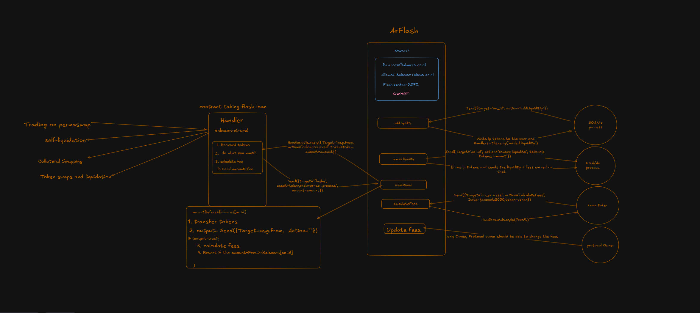

# Arflash: Flash Loan Protocol on Arweave

Arflash is a state-of-the-art decentralized flash loan protocol built on the Arweave blockchain, utilizing its actor-oriented smart contracts. By leveraging Arweave's hyper-parallelized contract capabilities, Arflash provides secure, transparent, and permanent financial transactions without requiring collateral, all within a single transaction.

## Protocol Blueprint

[Explore the Diagram](https://excalidraw.com/#room=87d6fe615f69235eef84,pPqvjaqty2HC5ZDZo4V2-g)

## Understanding Flash Loans

Flash loans are a form of uncollateralized lending that allows users to borrow and repay funds within a single transaction. This innovative tool is primarily used for:

- **Arbitrage**: Exploiting price differences across exchanges.
- **Collateral Swapping**: Adjusting collateral to optimize yield or reduce risk.
- **Self-Liquidation**: Preventing liquidation penalties by settling loans with other loans.

## Use Cases

### For Novices

Flash loans can simplify digital finance for beginners:

- **Trading**: Execute buy and sell operations for profit in one transaction.
- **Asset Swapping**: Exchange digital assets without losing value.
- **Error Correction**: Quickly rectify mistakes in digital transactions.

### For Professionals

Experienced traders can leverage flash loans for sophisticated strategies:

- **Arbitrage**: Capitalize on price discrepancies across multiple platforms.
- **Collateral Swapping**: Enhance yield or mitigate risk by exchanging collateral.
- **Self-Liquidation**: Avoid penalties by settling loans with other loans.
- **Debt Refinancing**: Benefit from improved interest rates or terms.
- **Yield Farming**: Optimize returns by reallocating assets across DeFi protocols.

## Why Choose Arweave?

Arweave offers a unique blockchain solution with sustainable and perpetual data storage. By building on Arweave, Arflash ensures that all transactions are immutable and permanently accessible, providing unparalleled security and transparency for financial operations.

## Key Features

- **Instant Loans**: Borrow as needed, with repayment by the transaction's end.
- **No Collateral Required**: Access loans without asset lock-up.
- **Decentralized**: Operate in a fully decentralized environment, free from intermediaries.
- **Permanent Records**: All transactions are permanently stored on the Arweave network.

## Getting Started with Arflash

To begin using Arflash, visit [Arflash App](https://arflash.vercel.app).

For more detailed instructions, please refer to the [documentation](https://calc1f4r.gitbook.io/arflash).

---

By following these steps, you can leverage the power of Arflash to enhance your financial operations on the Arweave blockchain.
